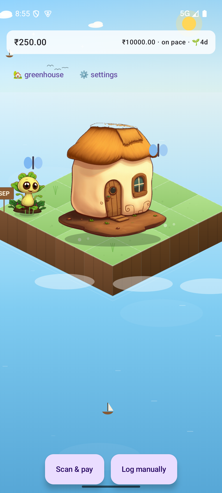
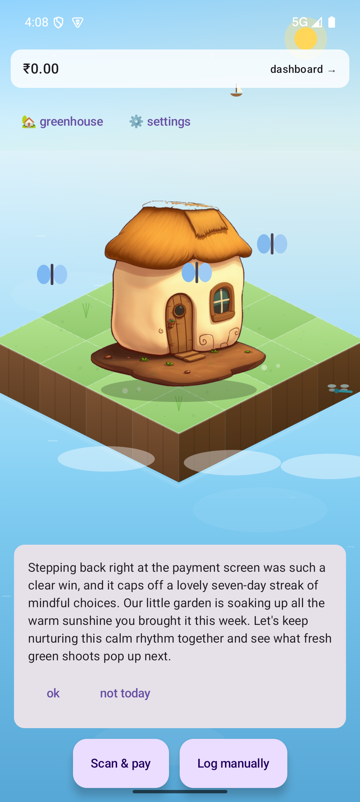
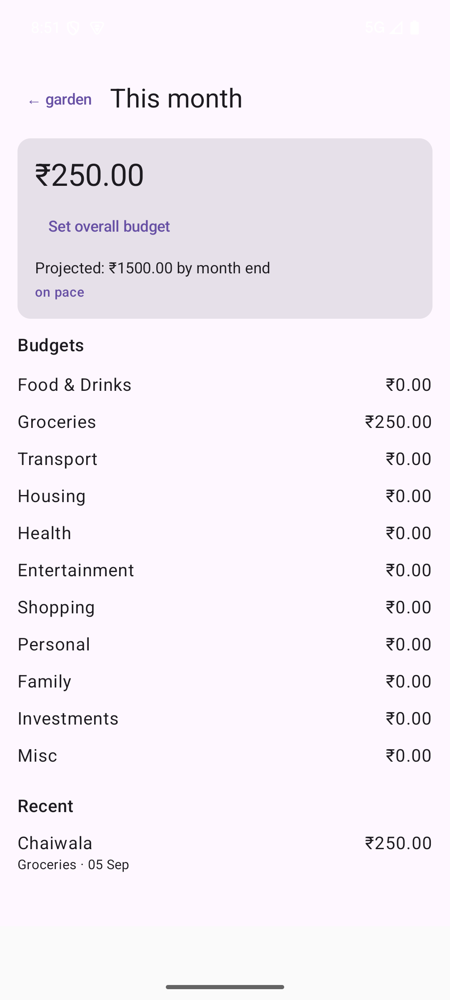

# expense-garden

A UPI expense tracker for Android where your spending grows a garden — and a resident who
has opinions about it.

Built for one user, on a hard constraint: **₹0/month, forever.** No paid APIs, no paid
hosting, no subscriptions. That constraint drove most of the interesting decisions in here.

<p align="center">
  
  
  
</p>

## What it does

Scan a UPI QR, and before the payment fires you get a **gate**: a single line telling you
where this purchase leaves your budget. Back out and the app records that you did — the
garden rewards it. Go through, and the transaction becomes a plant.

The garden is not decoration. Every plant is a real transaction; the species comes from the
category, the size from the amount, and a purchase you later tag as a regret grows into
something you have to look at. The house grows with months tracked, not money spent.

Once a day, if something actually changed, the resident says something about it.

## The parts worth reading

Three decisions shaped everything else.

**Money is `Long` paise, never a float.** Every amount in the app, the database and the
wire protocol is an integer count of paise. There is no floating-point arithmetic anywhere
in the money path.

**`game_event` is append-only, and the garden is a pure fold over it.** Nothing in the
codebase updates or deletes a game event. The entire visual state — plants, weather, house
level, streaks, butterflies — is derived by replaying the log, which means the renderer has
no state of its own and any past month can be reconstructed exactly. Eight event types:
`transaction.logged`, `transaction.regretted`, `transaction.regret_cleared`, `gate.dodged`,
`budget.pace_warning`, `budget.breached`, `streak.hit`, `month.closed`.

**The LLM is never in a read path.** This one is structural rather than defensive. The AI
layer only ever *writes* to two tables; screens only ever *read* them. So "the payment gate
works offline and never blocks on a network call" isn't enforced by a timeout — it is true
because there is no code path from a screen to the network. See
[`ai/`](app/src/main/java/com/expensegarden/app/ai/).

### Local-first, and what that costs

Room on the phone is the source of truth. The Go backend is a **replica**, not an authority
— it exists so a lost phone is recoverable, and it is forbidden from sitting in the payment
path. Sync is push-dominant with a monotonic logical clock rather than wall-clock
timestamps, because a phone whose clock jumps backwards must not be able to make a newer
row look older.

That logical clock exists because of a bug found in an earlier phase: a batch of events
stamped with a single `System.currentTimeMillis()` shares timestamps, and a timestamp cursor
over colliding timestamps silently loses rows. The fix generalises —
[`SyncClock`](app/src/main/java/com/expensegarden/app/sync/SyncClock.kt) guarantees strictly
increasing stamps, which is what makes the dirty-row predicate exact.

### Zero new dependencies

The Android dependency set is deliberately small and pinned: AndroidX core/lifecycle/activity,
Compose (BOM 2024.09.03), Material 3, Navigation, Room 2.6.1, and ZXing for QR scanning.
That's it — no Retrofit, no OkHttp, no Hilt, no DataStore, no WorkManager, no
serialization library.

Both network clients (Gemini and the sync client) are built on `java.net.HttpURLConnection`
and `org.json`, which ship with the platform. The backend has exactly one direct dependency,
`pgx/v5`; routing is the standard library.

This isn't minimalism for its own sake. A dependency you add is a dependency you maintain,
and for an app that makes at most a handful of network calls a day, a full HTTP stack is
weight without benefit.

## Repo layout

```
app/                      Android app (Kotlin, Compose)
  src/main/java/com/expensegarden/app/
    capture/              UPI QR parsing
    gate/                 pre-payment budget evaluation
    game/                 pure folds: garden state, digest triggers, tilers
    render/               isometric Canvas renderer
    data/                 Room entities, DAOs, repositories, migrations
    ai/                   Gemini client, persona, sanitizer, digest writer
    sync/                 backup client, logical clock, cursors
    ui/                   Compose screens and ViewModels
  schemas/                committed Room schema history (v1 → v4)
backend/core-api/         Go sync replica — see its own README
docs/superpowers/         the specs and plans this was built from
```

## Status

| Phase | State |
|---|---|
| 1A capture core | Done, except a real-payment E2E on a physical phone |
| 1B budgets + dashboard | Done |
| 1C garden (+1C.5–1C.7) | Done — 16 plant archetypes, 38 sprites, growing homestead |
| 1D AI layer | Done — verified live on device |
| 1E Fortune City import | Not started |
| 2A sync core | Done — wipe-and-restore verified on device |
| 2B deploy | Runbook written, awaiting hosting signup |

Phase 1's own acceptance criterion is *"done when it's the default way its user pays offline
merchants"* — a usage bar, not a code bar, and not met yet.

**Tests:** 181 JVM unit tests, 56 instrumented (Room/DAO/migration, run against a device),
8 Go tests against a real Postgres. CI runs the JVM and Go suites on every push;
instrumented tests stay a local gate because they need a booted emulator.

## Building

Requires JDK 17 (AGP 8.5.2 rejects older), Android SDK with `compileSdk 35`, `minSdk 26`.

```bash
./gradlew testDebugUnitTest        # JVM unit tests
./gradlew installDebug             # build + install on a connected device
```

Instrumented tests need a running emulator or device:

```bash
./gradlew connectedDebugAndroidTest
```

The AI layer is dormant until you enter a Gemini API key in Settings; everything else works
without one. Same for backup — no server URL means no sync, and the app is otherwise
unchanged.

Backend setup is in [`backend/core-api/README.md`](backend/core-api/README.md).

## How this was built

Every phase went spec → plan → implementation, and the documents are committed under
[`docs/superpowers/`](docs/superpowers/). They are not written after the fact; they are what
the code was built from, including the arguments that were lost.

The Phase 1D spec carries a review log with **nine review passes and 53 numbered findings**,
each recording what was wrong and where it was fixed. Several are bugs I would rather not
advertise — a watermark that lost data three separate ways, a sanitizer that matched `rent`
inside `different`, a model that Google retired mid-phase. They're in there because a design
document that only records the decisions that survived teaches nothing.

## Licence

None yet — personal project, published to be read.
